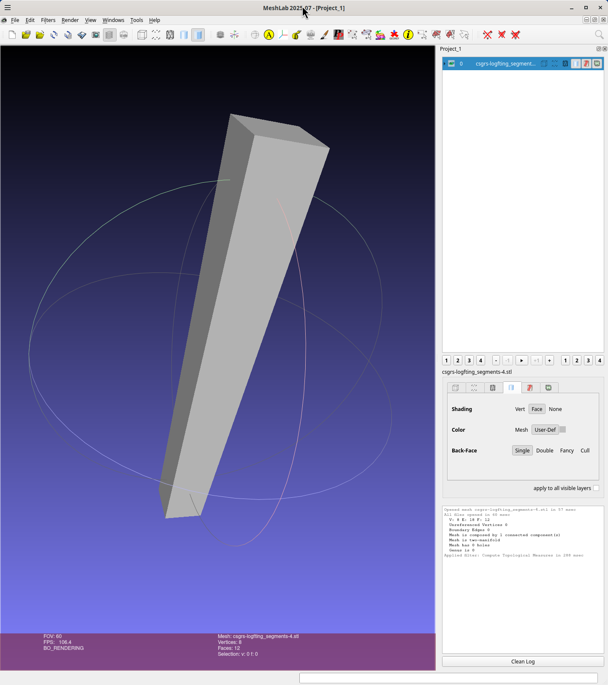
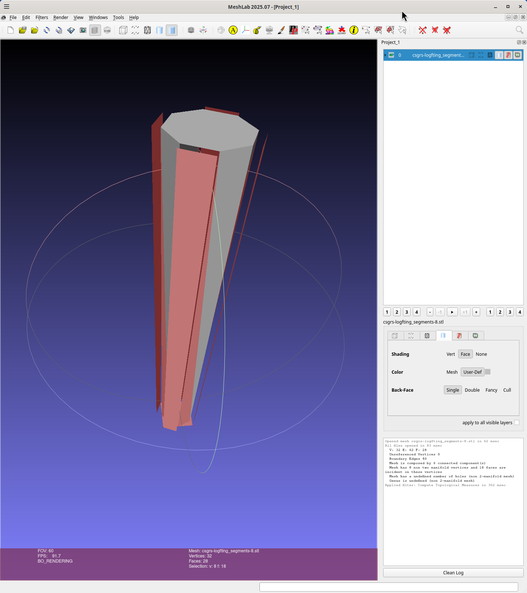

# csgrs-lofting

Test if csgrs::Sketch::loft works, it does for simple 4 sided squares:

```
wink@3900x 25-12-18T22:39:47.159Z:~/data/prgs/3dprinting/csgrs-lofting (main)
$ cp ../../licenses/README-APACHE-MIT-LICENSE.md README.md
wink@3900x 25-12-18T22:40:11.212Z:~/data/prgs/3dprinting/csgrs-lofting (main)
$ cargo run -- 4
    Finished `dev` profile [unoptimized + debuginfo] target(s) in 0.08s
     Running `target/debug/csgrs-lofting 4`
square_pts: 4
0: [-1.0, -1.0, 0.0]
1: [1.0, -1.0, 0.0]
2: [1.0, 1.0, 0.0]
3: [-1.0, 1.0, 0.0]
circle_pts: 4
0: [-1.414213562373095, -1.4142135623730951, 20.0]
1: [1.4142135623730951, -1.414213562373095, 20.0]
2: [1.4142135623730951, 1.414213562373095, 20.0]
3: [-1.414213562373095, 1.4142135623730951, 20.0]
Writing file: csgrs-logfting_segments-4.stl
wink@3900x 25-12-18T22:46:11.754Z:~/data/prgs/3dprinting/csgrs-lofting (main)
$ meshlab csgrs-logfting_segments-4.stl
Using OpenGL 4.6
LOG: 0 Opened mesh csgrs-logfting_segments-4.stl in 57 msec
LOG: 0 All files opened in 60 msec
LOG: 2 V:      8 E:     18 F:    12
LOG: 2 Unreferenced Vertices 0
LOG: 2 Boundary Edges 0
LOG: 2 Mesh is composed by 1 connected component(s)

LOG: 2 Mesh is two-manifold
LOG: 2 Mesh has 0 holes
LOG: 2 Genus is 0
LOG: 0 Applied filter: Compute Topological Measures in 288 msec
wink@3900x 25-12-18T22:48:12.235Z:~/data/prgs/3dprinting/csgrs-lofting (main)
```
And the image:



But not for a square to a "circle" i.e. 8 sided polygon:
```
wink@3900x 25-12-18T22:33:12.603Z:~/data/prgs/3dprinting/csgrs-lofting (main)
$ cargo run -- 8
    Finished `dev` profile [unoptimized + debuginfo] target(s) in 0.06s
     Running `target/debug/csgrs-lofting 8`
square_pts: 8
0: [-1.0, -1.0, 0.0]
1: [0.0, -1.0, 0.0]
2: [1.0, -1.0, 0.0]
3: [1.0, 0.0, 0.0]
4: [1.0, 1.0, 0.0]
5: [0.0, 1.0, 0.0]
6: [-1.0, 1.0, 0.0]
7: [-1.0, 0.0, 0.0]
circle_pts: 8
0: [-1.414213562373095, -1.4142135623730951, 20.0]
1: [1.2246467991473532e-16, -2.0, 20.0]
2: [1.4142135623730951, -1.414213562373095, 20.0]
3: [2.0, 0.0, 20.0]
4: [1.4142135623730951, 1.414213562373095, 20.0]
5: [1.2246467991473532e-16, 2.0, 20.0]
6: [-1.414213562373095, 1.4142135623730951, 20.0]
7: [-2.0, 2.4492935982947064e-16, 20.0]
Writing file: csgrs-logfting_segments-8.stl
wink@3900x 25-12-18T22:33:16.053Z:~/data/prgs/3dprinting/csgrs-lofting (main)
$ meshlab csgrs-logfting_segments-8.stl
Using OpenGL 4.6
LOG: 0 Opened mesh csgrs-logfting_segments-8.stl in 62 msec
LOG: 0 All files opened in 83 msec
"OpenSSL 3.6.0 1 Oct 2025"
"OpenSSL 3.6.0 1 Oct 2025"
Online version: 2025.07
LOG: 2 V:     32 E:     62 F:    28
LOG: 2 Unreferenced Vertices 0
LOG: 2 Boundary Edges 40
LOG: 2 Mesh is composed by 6 connected component(s)

LOG: 2 Mesh has 8 non two manifold vertices and 18 faces are incident on these vertices

LOG: 2 Mesh has a undefined number of holes (non 2-manifold mesh)
LOG: 2 Genus is undefined (non 2-manifold mesh)
LOG: 0 Applied filter: Compute Topological Measures in 302 msec
wink@3900x 25-12-18T22:39:47.159Z:~/data/prgs/3dprinting/csgrs-lofting (main)
```

And the image:


## License

Licensed under either of

- Apache License, Version 2.0 ([LICENSE-APACHE](LICENSE-APACHE) or http://apache.org/licenses/LICENSE-2.0)
- MIT license ([LICENSE-MIT](LICENSE-MIT) or http://opensource.org/licenses/MIT)

### Contribution

Unless you explicitly state otherwise, any contribution intentionally submitted
for inclusion in the work by you, as defined in the Apache-2.0 license, shall
be dual licensed as above, without any additional terms or conditions.
